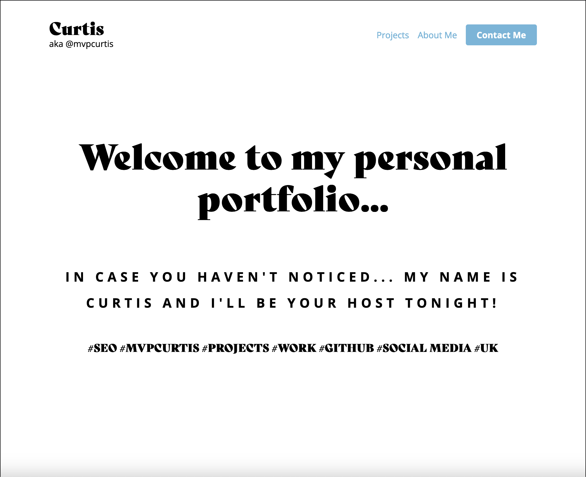
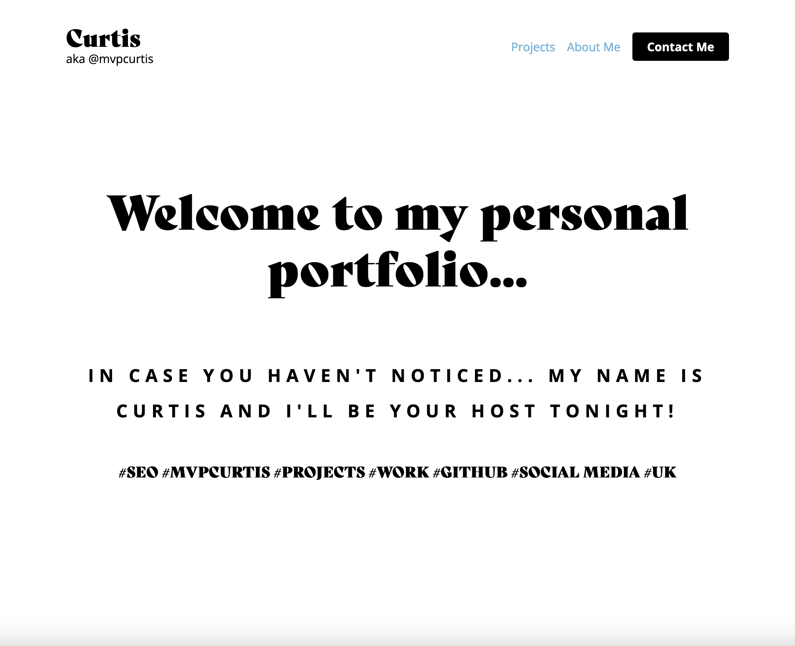
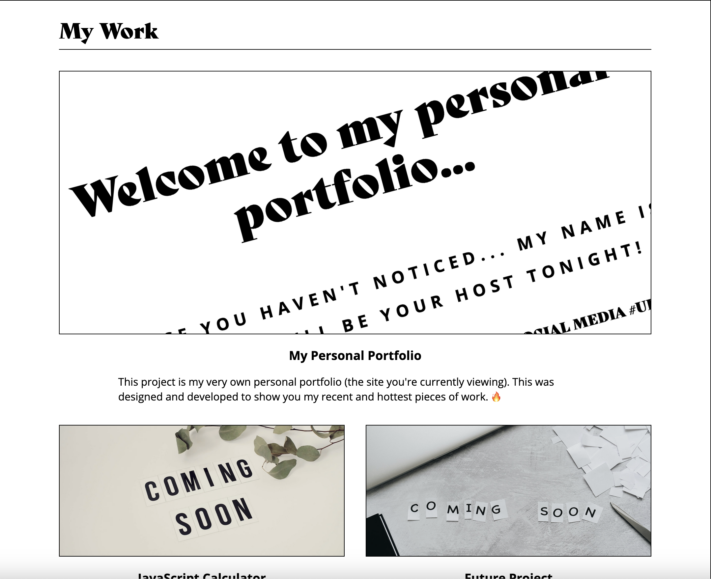
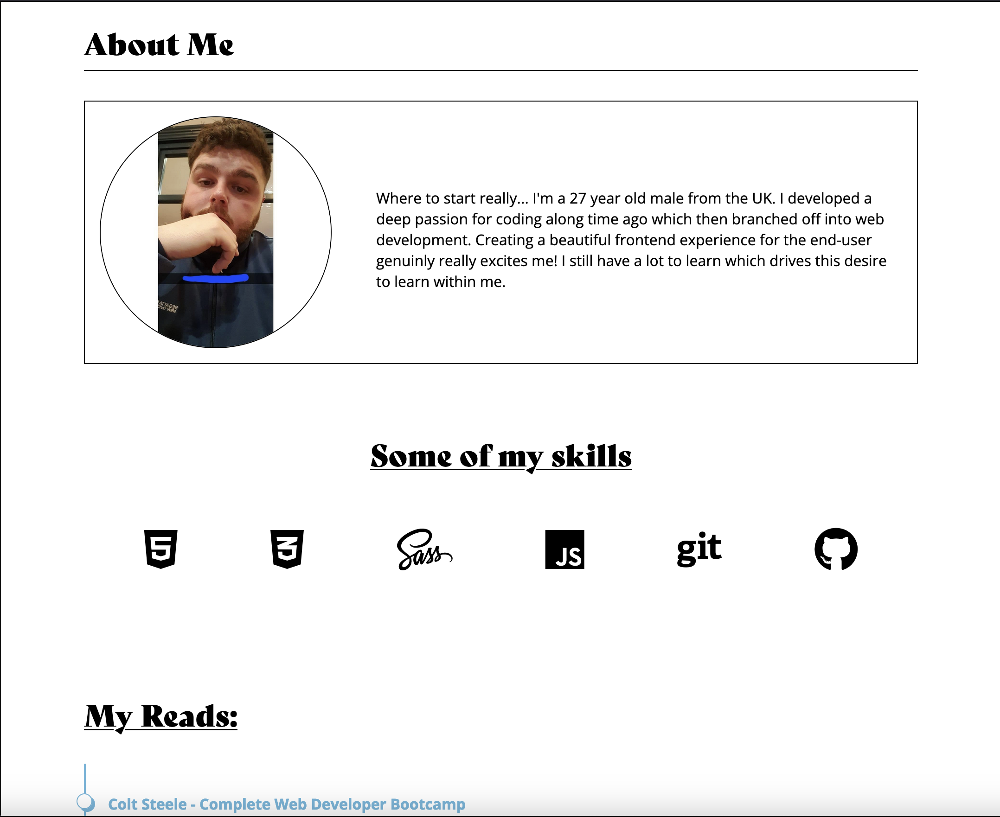
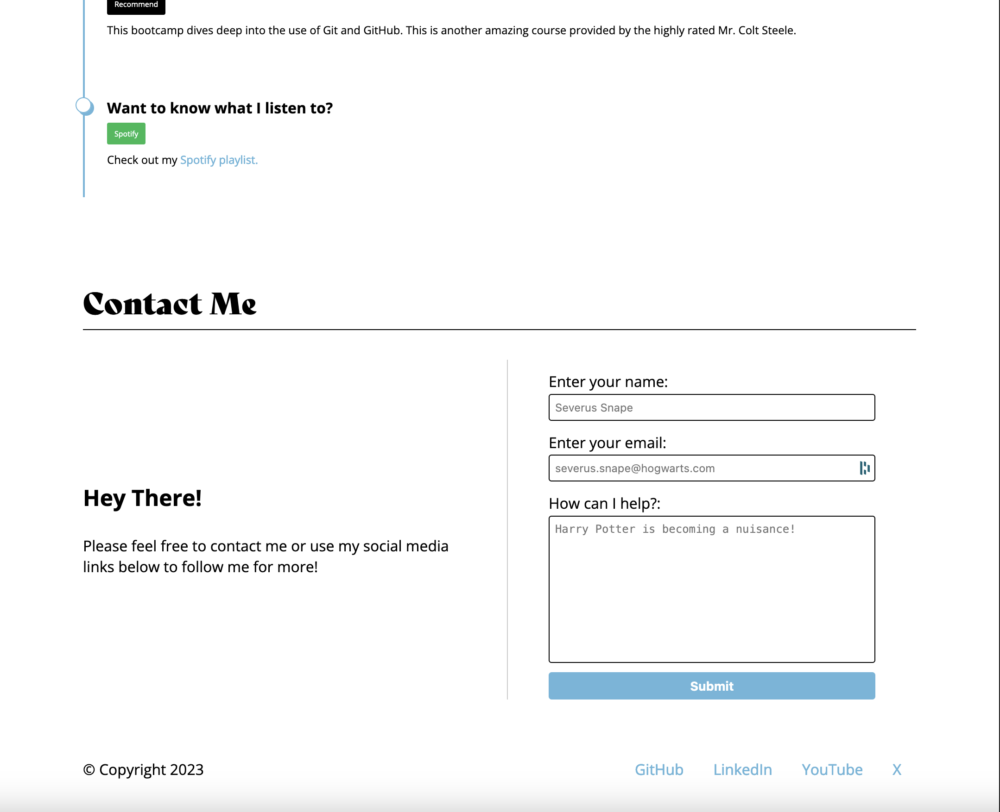
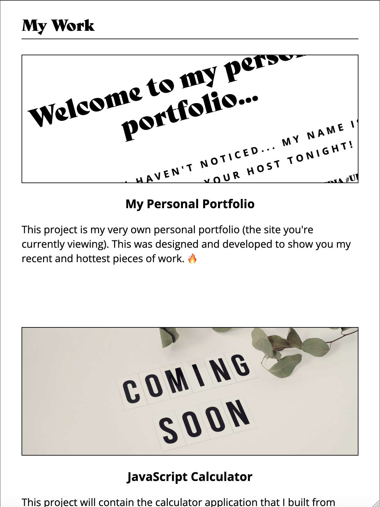
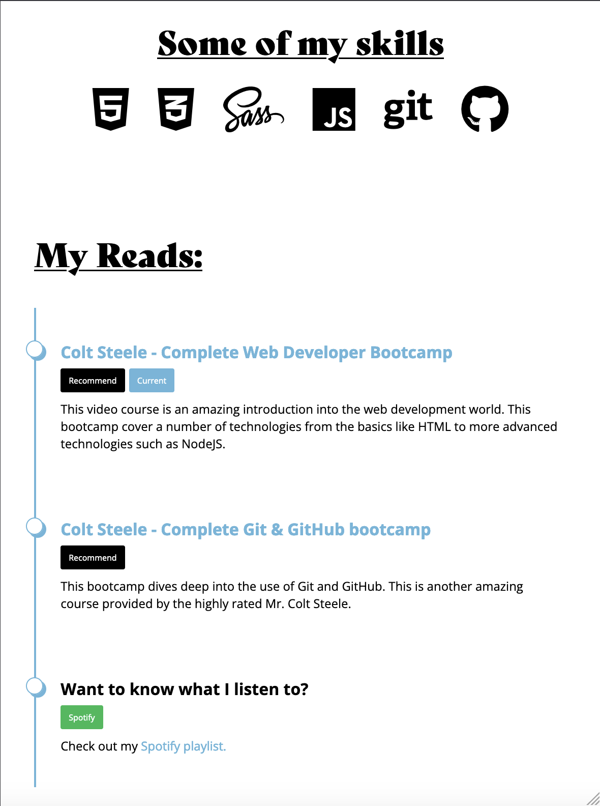
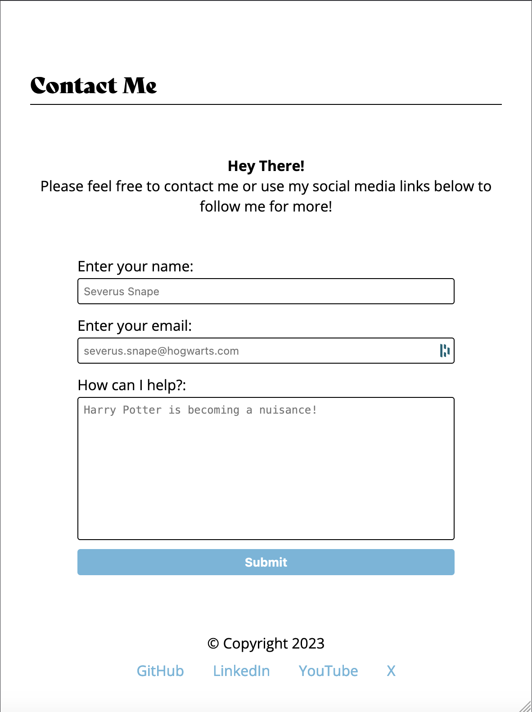

# My Personal Portfolio

## Description

This repository contains my very own personal portfolio, built from the ground up using the lastest techniques in HTML5 & CSS3. This is the holding post of all of my projects... to show them off to the world! To show people what I can do. As time goes on, this repository will be updated with my future projects and will replicate my live website.

Along the way, I expanded on multiple fronts. Using techniques I was uncomfortable with to obtain and structure I was happy with. Looking over my code to see any duplicates and implementing detailed comments throughout the project to help other developers out.

Using Git & GitHub along the way has been a life saver. I was able to jump from one computer to another with absolute ease!

For people who are interested... my live website will be hosted and maintained on Digital Oceon @ curtisbowen.xyz.

## Screenshots

### Desktop View

### Mobile View

## Credits

Some "placeholder" images are provided from users on Pexels.com.

## License

MIT License

Copyright (c) 2023 Curtis

Permission is hereby granted, free of charge, to any person obtaining a copy
of this software and associated documentation files (the "Software"), to deal
in the Software without restriction, including without limitation the rights
to use, copy, modify, merge, publish, distribute, sublicense, and/or sell
copies of the Software, and to permit persons to whom the Software is
furnished to do so, subject to the following conditions:

The above copyright notice and this permission notice shall be included in all
copies or substantial portions of the Software.

THE SOFTWARE IS PROVIDED "AS IS", WITHOUT WARRANTY OF ANY KIND, EXPRESS OR
IMPLIED, INCLUDING BUT NOT LIMITED TO THE WARRANTIES OF MERCHANTABILITY,
FITNESS FOR A PARTICULAR PURPOSE AND NONINFRINGEMENT. IN NO EVENT SHALL THE
AUTHORS OR COPYRIGHT HOLDERS BE LIABLE FOR ANY CLAIM, DAMAGES OR OTHER
LIABILITY, WHETHER IN AN ACTION OF CONTRACT, TORT OR OTHERWISE, ARISING FROM,
OUT OF OR IN CONNECTION WITH THE SOFTWARE OR THE USE OR OTHER DEALINGS IN THE
SOFTWARE.
